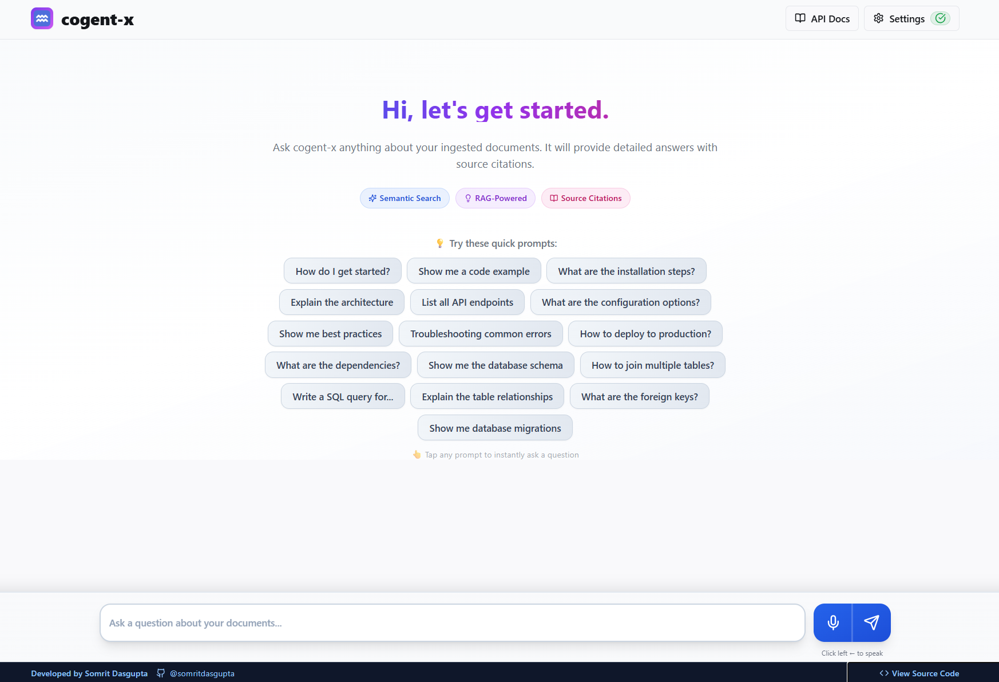
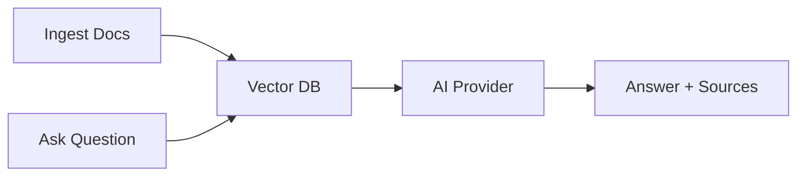

# Cogent-X

**Enterprise-grade RAG platform for building intelligent, private knowledge bases**

> Ask questions about your documentation and get AI-powered answers with source references

[](https://opensource.org/licenses/MIT)
[](https://www.python.org/downloads/)
[](https://reactjs.org/)



---

## Key Features

| Feature              | Description                                                 |
| -------------------- | ----------------------------------------------------------- |
| **Multi-AI Support** | Choose between Ollama (local), OpenAI GPT, or Google Gemini |
| **Voice Input**      | Fast local transcription with WhisperX (no API keys!)       |
| **Text-to-Speech**   | 10+ natural voices with adjustable speed                    |
| **Smart Copy**       | One-click copy answers as clean plain text                  |
| **Quick Prompts**    | 16 ready-to-use prompts for docs, SQL, troubleshooting      |
| **Privacy First**    | All processing local, encrypted API keys                    |
| **Mobile Ready**     | Fully responsive, works great on all devices                |

---

## Quick Start (One Command!)

**Windows:**

```bash
python run.py
```

**Linux/Mac:**

```bash
python3 run.py
```

That's it! The script automatically:

- Installs all dependencies (backend + frontend + FFmpeg)
- Sets up WhisperX for voice input
- Starts both servers (backend:8000, frontend:8080)
- Opens your browser

**First run**: 3-5 minutes | **Next runs**: Instant

### Access URLs

- **App**: http://localhost:8080
- **API**: http://localhost:8000
- **API Docs**: http://localhost:8000/docs

---

## How It Works



1. **Ingest**: Add documentation URLs
2. **Query**: Ask questions (text or voice)
3. **Answer**: Get AI responses with sources
4. **Listen**: Optional TTS playback

---

## Usage Guide

### Step 1: Configure AI Provider

Click **Settings** → **Providers** tab:

| Provider   | Setup                                                                          | Best For          |
| ---------- | ------------------------------------------------------------------------------ | ----------------- |
| **Ollama** | Local URL + model name                                                         | Privacy, no costs |
| **OpenAI** | API key from [platform.openai.com](https://platform.openai.com/api-keys)       | Best quality      |
| **Gemini** | API key from [makersuite.google.com](https://makersuite.google.com/app/apikey) | Good balance      |

**Note**: API keys are encrypted and stored locally

### Step 2: Ingest Documentation

**Option A - UI:**

- Click **Documents**
- Enter URL (e.g., `https://docs.python.org`)
- Click **Ingest URL**

**Option B - API:**

```bash
curl -X POST "http://localhost:8000/api/v1/ingest" \
  -H "Content-Type: application/json" \
  -d '{"url": "https://docs.python.org/3/"}'
```

### Step 3: Ask Questions

**Text Input:**

- Type your question
- Press Enter or click **Send**

**Voice Input:**

- Click microphone button
- Speak your question
- Wait 1-2 seconds for transcription

**Quick Prompts:**
Click any prompt to instantly ask:

- "How do I get started?"
- "Show me a code example"
- "Show me the database schema"
- "Troubleshooting common errors"
- ...and 12 more!

### Step 4: Interact with Answers

Every answer has:

- **Copy** - Get clean plain text
- **Read Aloud** - TTS playback
- **Sources** - View referenced docs

---

## Voice & TTS Settings

**Settings** → **Voice & TTS** tab:

### Voice Input (WhisperX)

- Free, local, no API keys
- 1-2 second transcription
- Auto language detection

### Text-to-Speech

| Setting   | Options                                                                 |
| --------- | ----------------------------------------------------------------------- |
| **Voice** | David, Zira, Mark, Hazel, Eva, James, Linda, Richard, Catherine, George |
| **Speed** | 0.5x - 2.0x (75-300 WPM)                                                |
| **Mode**  | Offline (pyttsx3) or Online (gTTS)                                      |

---

## Deployment

### Deploy on Render (Recommended - Free Forever)

**What works on free tier:**

- ✅ Frontend and backend deployment
- ✅ All AI providers (use API keys)
- ✅ Voice transcription and TTS
- ❌ Vector DB resets on service restart (use external storage)
- ⚠️ Services sleep after 15 mins inactivity

**Step-by-Step Guide:**

#### 1. Prepare Your Repository

Push your code to GitHub if not already done:

```bash
git add .
git commit -m "Prepare for deployment"
git push origin main
```

#### 2. Deploy Backend on Render

1. Go to [render.com](https://render.com) and sign up
2. Click **New** → **Web Service**
3. Connect your GitHub repository
4. Configure:

   - **Name**: `cogent-x-backend`
   - **Environment**: `Python 3`
   - **Build Command**: `cd backend && pip install -r requirements.txt`
   - **Start Command**: `cd backend && uvicorn main:app --host 0.0.0.0 --port $PORT`
   - **Instance Type**: `Free`

5. Add Environment Variables:

   ```
   OLLAMA_BASE_URL=https://your-ollama-service.com
   OLLAMA_MODEL=llama3:8b
   OPENAI_API_KEY=your-key-here
   GEMINI_API_KEY=your-key-here
   EMBEDDING_MODEL_NAME=BAAI/bge-large-en-v1.5
   VECTOR_DB_DIRECTORY=./vector_db
   ```

6. Click **Create Web Service**

#### 3. Deploy Frontend on Render

1. Click **New** → **Static Site**
2. Connect same repository
3. Configure:

   - **Name**: `cogent-x-frontend`
   - **Build Command**: `npm install && npm run build`
   - **Publish Directory**: `dist`
   - **Instance Type**: `Free`

4. Add Environment Variable:

   ````
      ```bash
   VITE_API_BASE_URL=https://cogent-x-backend.onrender.com
   ````

   ```

   ```

5. Click **Create Static Site**

#### 4. Update Frontend API URL

Update `vite.config.ts` to use environment variable:

```typescript
export default defineConfig({
  // ... other config
  define: {
    "import.meta.env.VITE_API_BASE_URL": JSON.stringify(
      process.env.VITE_API_BASE_URL || "http://localhost:8000"
    ),
  },
});
```

**Access Your App:**

- Frontend: `https://cogent-x-frontend.onrender.com`
- Backend: `https://cogent-x-backend.onrender.com`

---

### Deploy on Vercel (Frontend Only)

For frontend-only deployment (still need backend elsewhere):

```bash
npm install -g vercel
cd cogent-x
vercel
```

Follow prompts, then:

- Set build command: `npm run build`
- Set output directory: `dist`
- Add environment variable: `VITE_API_BASE_URL=your-backend-url`

---

### Important Notes for Free Hosting

**Platform Comparison:**

| Platform   | Best For            | Free Tier                  | Limitations                |
| ---------- | ------------------- | -------------------------- | -------------------------- |
| **Render** | **Recommended**     | Forever free               | Services sleep after 15min |
| Vercel     | Frontend only       | Forever free               | Need separate backend      |
| Railway    | Paid only (no free) | Trial only, then $5+/month | No longer offers free tier |

**Free Tier Limitations:**

- Services sleep after inactivity (15-30 min)
- First request after sleep takes 30-60 seconds
- Limited CPU/RAM resources
- Vector database may reset on service restart

**Best Practices:**

- **Use Render for easiest setup** - No CLI needed, web dashboard deployment
- Set API keys **through the UI**, not environment variables
- Use **OpenAI or Gemini** (local Ollama needs more resources)
- Keep vector DB small or use external storage (S3, R2)
- Use uptime monitoring to keep services alive ([uptimerobot.com](https://uptimerobot.com))
- **Note**: Vector DB resets when service sleeps - re-ingest documents as needed

**For Production/Always-On:**

- Railway: $5/month keeps services running
- Render Hobby: $7/month for persistent storage
- Your own VPS (DigitalOcean, Linode) for full control

---

## Docker Setup

```bash
# Build and start all services
docker-compose up --build

# Access
# Frontend: http://localhost:3000
# Backend: http://localhost:8000
```

**Services:**

- `frontend` - React app (port 3000)
- `backend` - FastAPI server (port 8000)
- `ollama` - Local LLM server (port 11434)

---

## Manual Setup (Advanced)

### Prerequisites

- Node.js 18+
- Python 3.9+
- FFmpeg

### Installation

**1. Clone Repository**

```bash
git clone https://github.com/somritdasgupta/cogent-x.git
cd cogent-x
```

**2. Backend Setup**

```bash
cd backend
pip install -r requirements.txt
uvicorn main:app --host 0.0.0.0 --port 8000
```

**3. Frontend Setup** (separate terminal)

```bash
npm install
npm run dev
```

**4. Install Ollama** (for local AI)

```bash
# Download from https://ollama.ai
ollama pull llama3:8b
```

---

## API Reference

### Core Endpoints

| Method     | Endpoint             | Description              |
| ---------- | -------------------- | ------------------------ |
| `POST`     | `/api/v1/ingest`     | Ingest documentation URL |
| `POST`     | `/api/v1/ask`        | Ask a question           |
| `POST`     | `/api/v1/transcribe` | Transcribe audio to text |
| `POST`     | `/api/v1/tts`        | Convert text to speech   |
| `GET`      | `/api/v1/health`     | System health check      |
| `GET/POST` | `/api/v1/config`     | Get/update configuration |

### Example: Ask Question

**Request:**

```bash
curl -X POST "http://localhost:8000/api/v1/ask" \
  -H "Content-Type: application/json" \
  -d '{
    "query": "How do I install packages?",
    "provider": "openai"
  }'
```

**Response:**

```json
{
  "answer": "To install packages, use pip...",
  "sources": [
    "https://docs.python.org/3/installing/",
    "https://pip.pypa.io/en/stable/"
  ]
}
```

### Example: Voice Transcription

**Request:**

```bash
curl -X POST "http://localhost:8000/api/v1/transcribe" \
  -F "audio=@recording.wav"
```

**Response:**

```json
{
  "text": "What is machine learning?",
  "language": "en",
  "duration": 2.5
}
```

### Example: Text-to-Speech

**Request:**

```bash
curl -X POST "http://localhost:8000/api/v1/tts" \
  -H "Content-Type: application/json" \
  -d '{
    "text": "Hello world",
    "voice": "David",
    "rate": 150
  }' \
  --output speech.mp3
```

**Full API Documentation**: http://localhost:8000/docs

---

## Configuration

### Environment Variables

Create `.env` file in project root:

```env
# API Configuration
API_HOST=0.0.0.0
API_PORT=8000
FASTAPI_BACKEND_URL=http://localhost:8000

# Storage
VECTOR_DB_DIRECTORY=./vector_db
EMBEDDING_MODEL_NAME=BAAI/bge-large-en-v1.5

# Ollama (Local AI)
OLLAMA_BASE_URL=http://localhost:11434
OLLAMA_MODEL=llama3:8b

# OpenAI (Optional)
OPENAI_API_KEY=sk-proj-...
OPENAI_MODEL=gpt-4

# Gemini (Optional)
GEMINI_API_KEY=AIzaSy...
GEMINI_MODEL=gemini-pro
```

**Note**: Or configure everything in the UI Settings panel!

---

## Tech Stack

### Frontend

- React 18 + TypeScript
- Vite (build tool)
- shadcn/ui + Tailwind CSS
- Lucide Icons

### Backend

- FastAPI (Python 3.9+)
- FAISS (vector database)
- Sentence Transformers (embeddings)
- WhisperX (voice input)
- pyttsx3 + gTTS (text-to-speech)

### AI Providers

- Ollama (local)
- OpenAI GPT
- Google Gemini

---

## Troubleshooting

<details>
<summary><strong>LLM Service shows disconnected</strong></summary>

**For Ollama:**

```bash
# Check if Ollama is running
ollama list

# Pull model if missing
ollama pull llama3:8b
```

**For OpenAI/Gemini:**

- Verify API key in Settings
- Check internet connection
- Ensure you have API credits
</details>

<details>
<summary><strong>Voice input not working</strong></summary>

**Check FFmpeg installation:**

```bash
# Windows
ffmpeg -version

# Install if missing
# Download from: https://ffmpeg.org/download.html
```

**Check WhisperX:**

```bash
pip install whisperx
```

</details>

<details>
<summary><strong>Documents not ingesting</strong></summary>

- Verify URL is accessible
- Check if website allows scraping
- Ensure `vector_db` directory has write permissions
- Check backend logs: `docker logs cogent-x-backend-1`
</details>

<details>
<summary><strong>TTS not playing audio</strong></summary>

- Check browser audio permissions
- Try different voice in Settings
- Toggle between offline/online mode
- Check speaker/headphone connection
</details>

---

## Performance Tips

| Component   | Tip                                                 |
| ----------- | --------------------------------------------------- |
| **Ollama**  | Use 7B models for speed, 13B+ for quality           |
| **OpenAI**  | `gpt-3.5-turbo` is faster/cheaper than `gpt-4`      |
| **Storage** | Use SSD for better vector search performance        |
| **Voice**   | WhisperX "tiny" model = best speed/accuracy balance |
| **TTS**     | Offline mode (pyttsx3) is faster than online        |

---

## What's New (v2.0)

### Voice & Audio

- WhisperX voice input (1-2 sec transcription)
- Text-to-Speech with 10+ voices
- Speed control (0.5x - 2.0x)

### UI Improvements

- Copy button for clean text answers
- 16 developer-focused quick prompts
- Fully responsive mobile design
- Modern dark theme

### Backend

- Migrated to FAISS (faster than ChromaDB)
- Better error handling
- Enhanced security

---

## Contributing

1. Fork the repository
2. Create feature branch: `git checkout -b feature-name`
3. Commit changes: `git commit -am 'Add feature'`
4. Push to branch: `git push origin feature-name`
5. Submit Pull Request

**Code Standards:**

- Self-documenting code (no comments)
- TypeScript for type safety
- Follow existing naming conventions
- Test with all 3 AI providers

---

## License

MIT License - see [LICENSE](LICENSE) file for details

---

## Developer

**Somrit Dasgupta**

- GitHub: [@somritdasgupta](https://github.com/somritdasgupta)
- Issues: [GitHub Issues](https://github.com/somritdasgupta/cogent-x/issues)
- LinkedIn: [Connect](https://linkedin.com/in/somritdasgupta)

---

## Show Your Support

If you find this project useful, please consider giving it a star on GitHub!

**Share with others:**

```bash
# Clone and try it
git clone https://github.com/somritdasgupta/cogent-x.git
cd cogent-x
python run.py
```

---

<div align="center">

**Built with care using React, FastAPI, and AI**

[Homepage](https://github.com/somritdasgupta/cogent-x) • [Docs](https://github.com/somritdasgupta/cogent-x/wiki) • [Report Bug](https://github.com/somritdasgupta/cogent-x/issues) • [Request Feature](https://github.com/somritdasgupta/cogent-x/issues)

</div>
