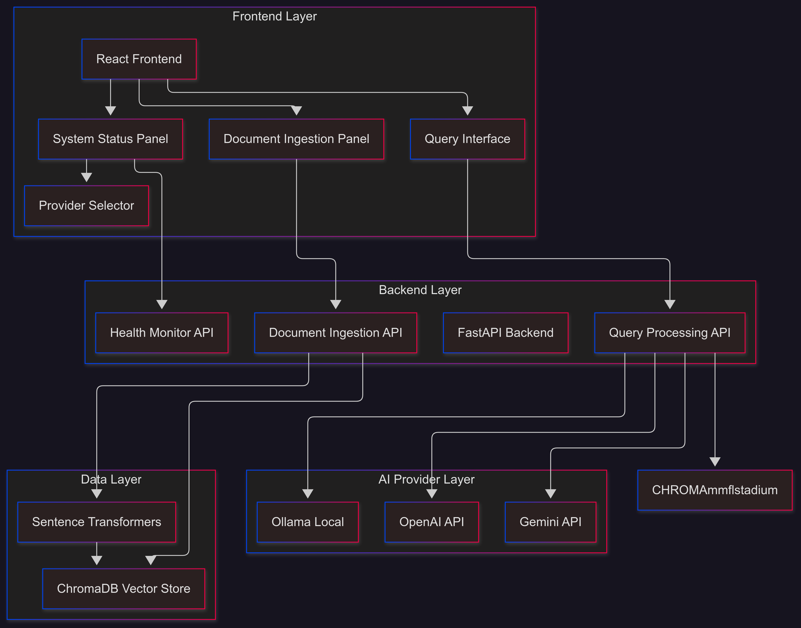
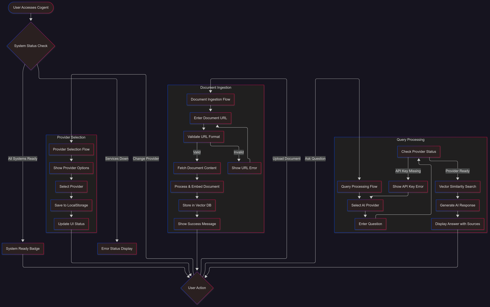

# Cogent - Private RAG System

Enterprise-grade Retrieval-Augmented Generation platform for building intelligent, private knowledge bases. Supports multiple AI providers: Open Source LLMs (Ollama), OpenAI GPT, and Google Gemini.

## Architecture

- **Frontend**: React + Vite + TypeScript with responsive design
- **Backend**: FastAPI (Python) with multi-provider support
- **AI Providers**: Ollama (Local), OpenAI GPT, Google Gemini
- **Vector Database**: ChromaDB with persistent storage
- **Embeddings**: Hugging Face Sentence Transformers

### Architecture & Flow Diagrams

<p align="center">
  
</p>

_Figure: High-level architecture — Frontend, Backend, Data Layer (ChromaDB), and AI Provider Layer (Ollama, OpenAI, Gemini)._

<p align="center">
  
</p>

_Figure: System flow — user actions, provider selection, document ingestion, and query processing flows._

## Prerequisites

- Node.js 18+
- Python 3.9+
- Docker & Docker Compose

## Quick Start

### 1. Clone Repository

```bash
git clone https://github.com/somritdasgupta/cogent.git
cd cogent
```

### 2. Environment Setup

Copy the environment file:

```bash
cp .env.example .env
```

Configure your `.env` file based on your preferred AI provider:

#### For Open Source (Ollama) - Default Setup

```env
# Ollama Configuration
OLLAMA_BASE_URL=http://localhost:11434
OLLAMA_MODEL=llama3:8b

# Embedding Model
EMBEDDING_MODEL_NAME=BAAI/bge-large-en-v1.5

# Storage & API
CHROMA_PERSIST_DIRECTORY=./chroma_db
API_HOST=0.0.0.0
API_PORT=8000
FASTAPI_BACKEND_URL=http://localhost:8000
```

#### For OpenAI Integration

Add these lines to your `.env`:

```env
# OpenAI Configuration
OPENAI_API_KEY=sk-proj-xxxxxxxxxxxxxxxxxxxxxxxxxxxxxxxxxxxxxxxxxxxxx
OPENAI_MODEL=gpt-4
```

**Where to get OpenAI API Key:**

1. Visit [OpenAI Platform](https://platform.openai.com/)
2. Sign up or log in to your account
3. Go to API Keys section
4. Click "Create new secret key"
5. Copy the key (starts with `sk-proj-` or `sk-`)

#### For Google Gemini Integration

Add these lines to your `.env`:

```env
# Gemini Configuration
GEMINI_API_KEY=AIzaSyxxxxxxxxxxxxxxxxxxxxxxxxxxxxxxxxxxxxx
GEMINI_MODEL=gemini-pro
```

**Where to get Gemini API Key:**

1. Visit [Google AI Studio](https://makersuite.google.com/app/apikey)
2. Sign in with your Google account
3. Click "Create API Key"
4. Copy the key (starts with `AIzaSy`)

### 3. Install Required Services

#### For Open Source Setup (Ollama)

Install Ollama from [ollama.ai](https://ollama.ai) and pull your model:

```bash
# Install Ollama first, then:
ollama pull llama3:8b

# Alternative models:
ollama pull mistral:7b
ollama pull codellama:13b
```

#### For Cloud Providers (OpenAI/Gemini)

No additional installation needed - just ensure your API keys are valid.

### 4. Launch Application

#### Using Docker (Recommended)

```bash
docker-compose up --build
```

#### Manual Development Setup

Frontend:

```bash
npm install
npm run dev
```

Backend (in separate terminal):

```bash
cd backend
pip install -r requirements.txt
uvicorn main:app --host 0.0.0.0 --port 8000 --reload
```

### 5. Access Application

- **Frontend**: http://localhost:3000
- **Backend API**: http://localhost:8000
- **API Documentation**: http://localhost:8000/docs

## Using the Application

### 1. Select AI Provider

- Open the application in your browser
- In the System Status panel, use the dropdown to select your AI provider:
  - **Open Source**: Uses local Ollama models
  - **OpenAI**: Uses GPT models via API
  - **Gemini**: Uses Google's Gemini via API

### 2. Ingest Documents

- Enter a URL in the Document Ingestion panel
- Click "Ingest URL" to process and store the content
- Wait for confirmation that documents are processed

### 3. Query Your Knowledge Base

- Type questions in the Query Interface
- Get AI-powered answers based on your ingested documents
- View source references for each response

## API Reference

### Document Ingestion

**Endpoint**: `POST /api/v1/ingest`

**Request Format**:

```json
{
  "url": "https://example.com/documentation"
}
```

**Parameters**:

- `url` (string, required): Valid HTTP/HTTPS URL to scrape and ingest

**Example**:

```bash
curl -X POST "http://localhost:8000/api/v1/ingest" \
  -H "Content-Type: application/json" \
  -d '{"url": "https://docs.python.org/3/"}'
```

### Query Processing

**Endpoint**: `POST /api/v1/ask`

**Request Format**:

```json
{
  "query": "What is Python used for?",
  "provider": "openai"
}
```

**Parameters**:

- `query` (string, required): Your question about the ingested documents
- `provider` (string, optional): AI provider to use
  - `"opensource"` - Uses Ollama (default)
  - `"openai"` - Uses OpenAI GPT
  - `"gemini"` - Uses Google Gemini

**Response Format**:

```json
{
  "answer": "Python is a versatile programming language...",
  "sources": [
    "https://docs.python.org/3/tutorial/",
    "https://docs.python.org/3/library/"
  ]
}
```

**Example**:

```bash
curl -X POST "http://localhost:8000/api/v1/ask" \
  -H "Content-Type: application/json" \
  -d '{"query": "How do I install Python packages?", "provider": "openai"}'
```

### Health Check

**Endpoint**: `GET /api/v1/health`

**Response**:

```json
{
  "backend": true,
  "llm": true,
  "vectorDB": true
}
```

**Status Indicators**:

- `backend`: FastAPI server status
- `llm`: AI provider connectivity (Ollama/OpenAI/Gemini)
- `vectorDB`: ChromaDB connection status

## Environment Variables Reference

### Core Configuration

- `API_HOST`: Backend server host (default: `0.0.0.0`)
- `API_PORT`: Backend server port (default: `8000`)
- `FASTAPI_BACKEND_URL`: Frontend-to-backend connection URL

### Storage Configuration

- `CHROMA_PERSIST_DIRECTORY`: ChromaDB data storage location
- `EMBEDDING_MODEL_NAME`: Hugging Face model for text embeddings

### Ollama Configuration (Open Source)

- `OLLAMA_BASE_URL`: Ollama server endpoint
- `OLLAMA_MODEL`: Model name (e.g., `llama3:8b`, `mistral:7b`)

### OpenAI Configuration (Optional)

- `OPENAI_API_KEY`: Your OpenAI API key (from platform.openai.com)
- `OPENAI_MODEL`: Model to use (e.g., `gpt-4`, `gpt-3.5-turbo`)

### Google Gemini Configuration (Optional)

- `GEMINI_API_KEY`: Your Gemini API key (from makersuite.google.com)
- `GEMINI_MODEL`: Model to use (e.g., `gemini-pro`)

## Troubleshooting

### Common Issues

**"OpenAI API key not configured"**

- Ensure `OPENAI_API_KEY` is set in your `.env` file
- Verify the key starts with `sk-` and is valid
- Check your OpenAI account has sufficient credits

**"Gemini API key not configured"**

- Ensure `GEMINI_API_KEY` is set in your `.env` file
- Verify the key starts with `AIzaSy` and is valid
- Ensure Gemini API is enabled in your Google Cloud project

**"LLM Service" shows as disconnected**

- For Ollama: Ensure Ollama is running and the model is pulled
- For cloud providers: Check API keys and internet connectivity
- Verify the model names match what's available

**Documents not ingesting**

- Check if the URL is accessible
- Ensure the website allows scraping
- Verify ChromaDB has write permissions to persist directory

### Performance Tips

- **Ollama**: Use smaller models (7B) for faster responses, larger models (13B+) for better quality
- **OpenAI**: `gpt-3.5-turbo` is faster and cheaper than `gpt-4`
- **Gemini**: `gemini-pro` offers good balance of speed and quality
- **Storage**: Use SSD storage for ChromaDB for better performance

## Development Guidelines

This project follows enterprise development standards:

- **Zero comments**: Code is self-documenting through clear naming
- **Enterprise naming**: Descriptive function and variable names
- **No hardcoding**: All configuration via environment variables
- **Modular architecture**: Separated concerns and reusable components
- **Type safety**: Full TypeScript implementation with proper types

## Contributing

1. Fork the repository
2. Create your feature branch
3. Follow the existing code style and naming conventions
4. Test your changes with all three AI providers
5. Submit a pull request

## License

MIT License - see LICENSE file for details

## Developer

**Developed by**: [Somrit Dasgupta](https://github.com/somritdasgupta)

**Source Code**: [github.com/somritdasgupta/cogent](https://github.com/somritdasgupta/cogent)

**Issues & Support**: [GitHub Issues](https://github.com/somritdasgupta/cogent/issues)
