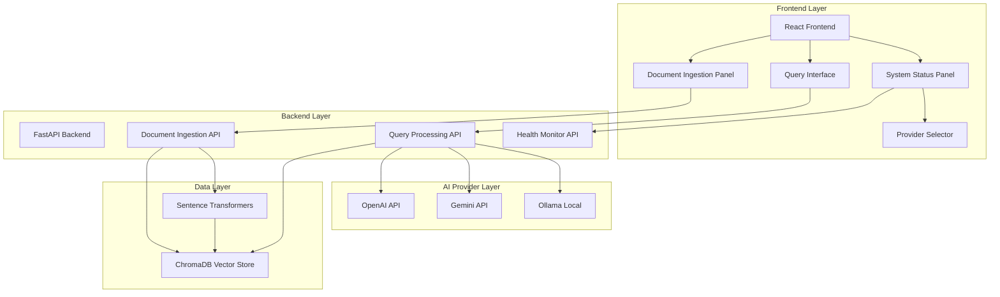
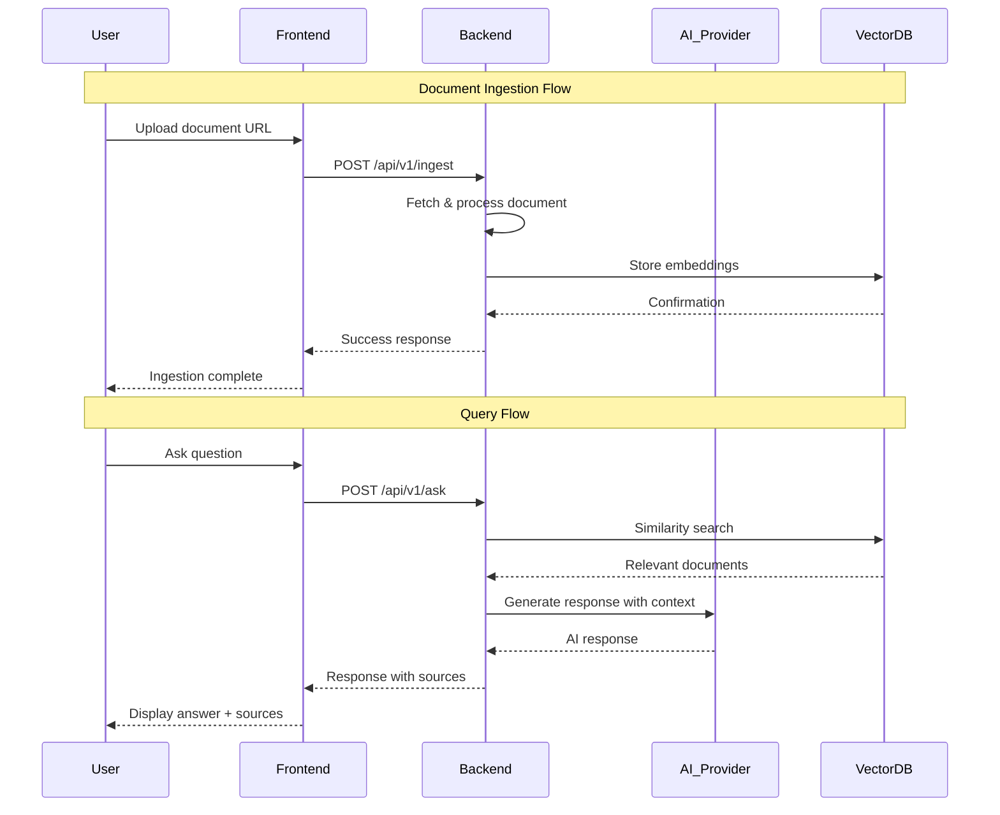
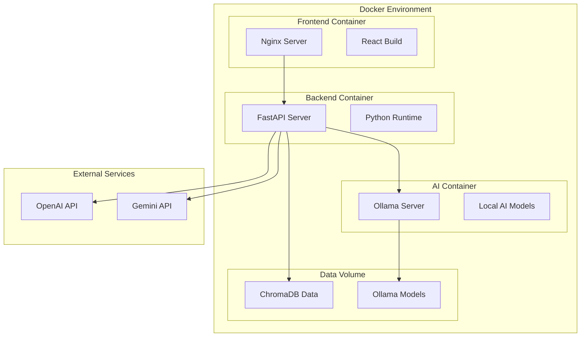
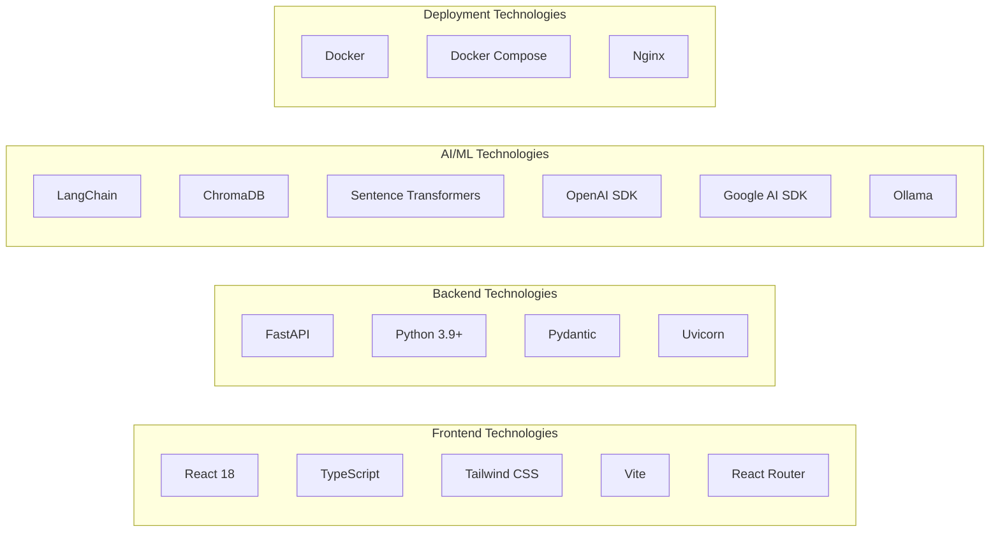

# System Architecture Diagrams

## Overall System Architecture

<div>
<h3>cogent-x RAG System Architecture</h3>
<div style="border: 1px solid #ccc; padding: 20px; margin: 10px 0; background: #f9f9f9;">

```
┌─────────────────────────────────────────────────────────────────┐
│                        Frontend (React)                         │
│  ┌─────────────────┐ ┌─────────────────┐ ┌─────────────────┐   │
│  │ Document        │ │ Query Interface │ │ System Status   │   │
│  │ Ingestion Panel │ │                 │ │ Panel           │   │
│  └─────────────────┘ └─────────────────┘ └─────────────────┘   │
└─────────────────────────────────────────────────────────────────┘
                               │ HTTP/REST API
                               ▼
┌─────────────────────────────────────────────────────────────────┐
│                      Backend (FastAPI)                         │
│  ┌─────────────────┐ ┌─────────────────┐ ┌─────────────────┐   │
│  │ Document        │ │ Query Processor │ │ Health Monitor  │   │
│  │ Ingestion API   │ │                 │ │                 │   │
│  └─────────────────┘ └─────────────────┘ └─────────────────┘   │
└─────────────────────────────────────────────────────────────────┘
           │                       │                       │
           ▼                       ▼                       ▼
┌─────────────────┐ ┌─────────────────────────────┐ ┌─────────────────┐
│   ChromaDB      │ │      AI Provider Layer      │ │    Ollama       │
│  (Vector Store) │ │                             │ │ (Open Source)   │
│                 │ │  ┌─────────┐ ┌─────────┐    │ │                 │
│ • Document      │ │  │ OpenAI  │ │ Gemini  │    │ │ • Local Models  │
│   Embeddings    │ │  │   API   │ │   API   │    │ │ • No API Keys   │
│ • Similarity    │ │  └─────────┘ └─────────┘    │ │ • Free Usage    │
│   Search        │ │                             │ │                 │
└─────────────────┘ └─────────────────────────────┘ └─────────────────┘
```

</div>
</div>

## Mermaid Architecture Diagram



## Component Interaction Flow



## Deployment Architecture



## Technology Stack Diagram


