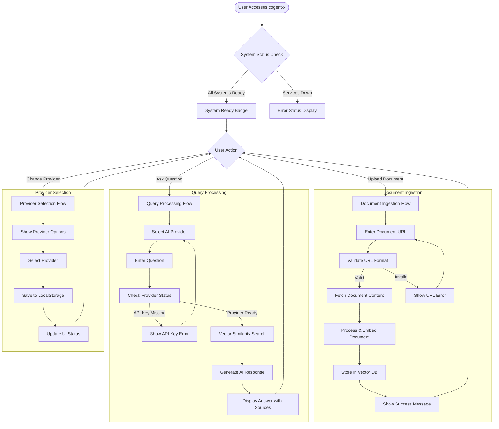
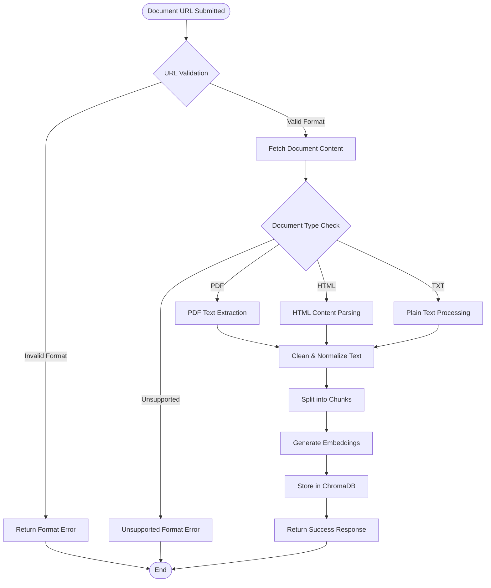
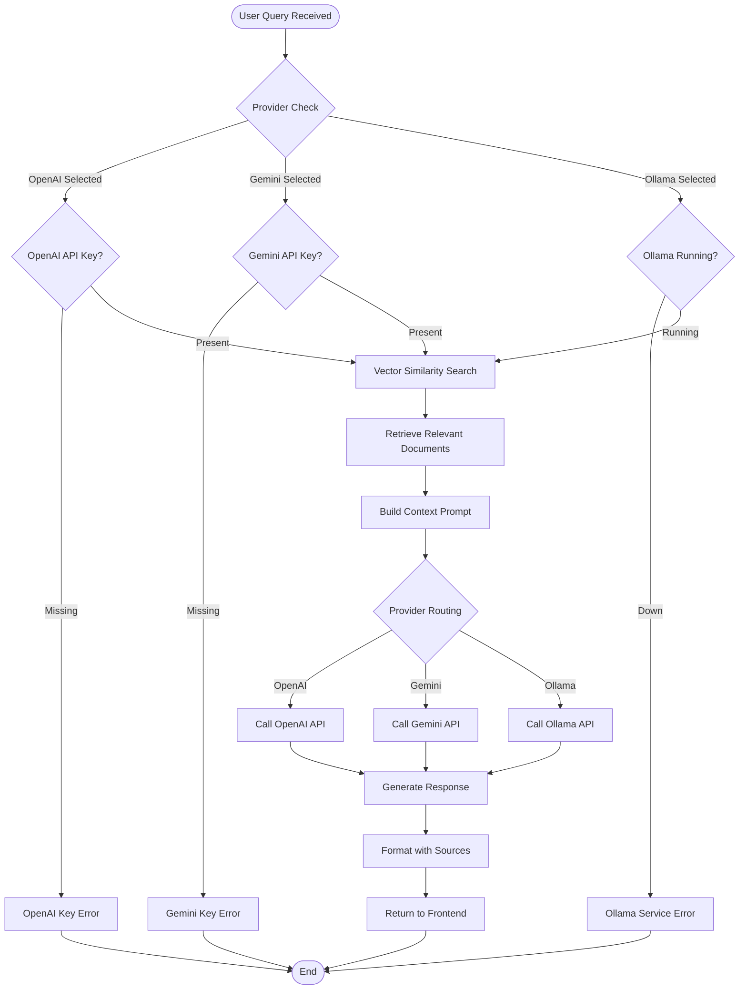
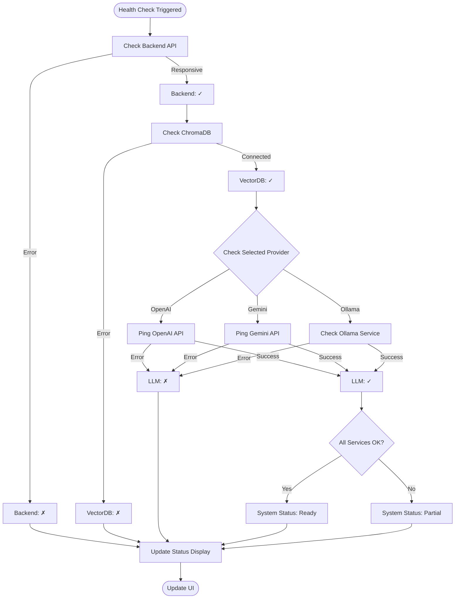
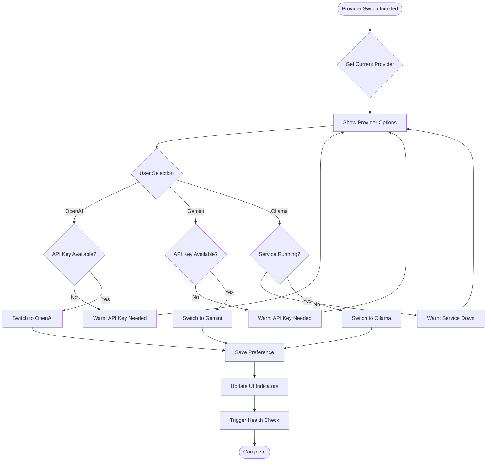

# System Flow Diagrams

## User Journey Flow

```mermaid
flowchart TD
    START([User Accesses cogent-x]) --> CHECK{System Status Check}
    CHECK -->|All Systems Ready| READY[System Ready Badge]
    CHECK -->|Services Down| ERROR[Error Status Display]

    READY --> CHOICE{User Action}

    CHOICE -->|Upload Document| INGEST[Document Ingestion Flow]
    CHOICE -->|Ask Question| QUERY[Query Processing Flow]
    CHOICE -->|Change Provider| PROVIDER[Provider Selection Flow]

    subgraph "Document Ingestion"
        INGEST --> INPUT_URL[Enter Document URL]
        INPUT_URL --> VALIDATE[Validate URL Format]
        VALIDATE -->|Valid| FETCH[Fetch Document Content]
        VALIDATE -->|Invalid| URL_ERROR[Show URL Error]
        FETCH --> PROCESS[Process & Embed Document]
        PROCESS --> STORE[Store in Vector DB]
        STORE --> INGEST_SUCCESS[Show Success Message]
        URL_ERROR --> INPUT_URL
    end

    subgraph "Query Processing"
        QUERY --> SELECT_PROVIDER[Select AI Provider]
        SELECT_PROVIDER --> ENTER_QUESTION[Enter Question]
        ENTER_QUESTION --> VALIDATE_PROVIDER[Check Provider Status]
        VALIDATE_PROVIDER -->|API Key Missing| KEY_ERROR[Show API Key Error]
        VALIDATE_PROVIDER -->|Provider Ready| SEARCH[Vector Similarity Search]
        SEARCH --> GENERATE[Generate AI Response]
        GENERATE --> DISPLAY[Display Answer with Sources]
        KEY_ERROR --> SELECT_PROVIDER
    end

    subgraph "Provider Selection"
        PROVIDER --> SHOW_OPTIONS[Show Provider Options]
        SHOW_OPTIONS --> SELECT[Select Provider]
        SELECT --> SAVE_PREF[Save to LocalStorage]
        SAVE_PREF --> UPDATE_UI[Update UI Status]
    end

    INGEST_SUCCESS --> CHOICE
    DISPLAY --> CHOICE
    UPDATE_UI --> CHOICE
```

## Document Ingestion Process Flow

```mermaid
flowchart TD
    START([Document URL Submitted]) --> VALIDATE{URL Validation}
    VALIDATE -->|Invalid Format| ERROR1[Return Format Error]
    VALIDATE -->|Valid Format| FETCH[Fetch Document Content]

    FETCH --> CHECK_TYPE{Document Type Check}
    CHECK_TYPE -->|PDF| PDF_PROCESS[PDF Text Extraction]
    CHECK_TYPE -->|HTML| HTML_PROCESS[HTML Content Parsing]
    CHECK_TYPE -->|TXT| TXT_PROCESS[Plain Text Processing]
    CHECK_TYPE -->|Unsupported| ERROR2[Unsupported Format Error]

    PDF_PROCESS --> CLEAN[Clean & Normalize Text]
    HTML_PROCESS --> CLEAN
    TXT_PROCESS --> CLEAN

    CLEAN --> CHUNK[Split into Chunks]
    CHUNK --> EMBED[Generate Embeddings]
    EMBED --> STORE[Store in ChromaDB]

    STORE --> SUCCESS[Return Success Response]

    ERROR1 --> END([End])
    ERROR2 --> END
    SUCCESS --> END
```

## Query Processing Flow

```mermaid
flowchart TD
    START([User Query Received]) --> CHECK_PROVIDER{Provider Check}
    CHECK_PROVIDER -->|OpenAI Selected| CHECK_OPENAI{OpenAI API Key?}
    CHECK_PROVIDER -->|Gemini Selected| CHECK_GEMINI{Gemini API Key?}
    CHECK_PROVIDER -->|Ollama Selected| CHECK_OLLAMA{Ollama Running?}

    CHECK_OPENAI -->|Missing| ERROR_OPENAI[OpenAI Key Error]
    CHECK_GEMINI -->|Missing| ERROR_GEMINI[Gemini Key Error]
    CHECK_OLLAMA -->|Down| ERROR_OLLAMA[Ollama Service Error]

    CHECK_OPENAI -->|Present| SEARCH[Vector Similarity Search]
    CHECK_GEMINI -->|Present| SEARCH
    CHECK_OLLAMA -->|Running| SEARCH

    SEARCH --> RETRIEVE[Retrieve Relevant Documents]
    RETRIEVE --> CONTEXT[Build Context Prompt]

    CONTEXT --> ROUTE{Provider Routing}
    ROUTE -->|OpenAI| OPENAI_API[Call OpenAI API]
    ROUTE -->|Gemini| GEMINI_API[Call Gemini API]
    ROUTE -->|Ollama| OLLAMA_API[Call Ollama API]

    OPENAI_API --> RESPONSE[Generate Response]
    GEMINI_API --> RESPONSE
    OLLAMA_API --> RESPONSE

    RESPONSE --> FORMAT[Format with Sources]
    FORMAT --> RETURN[Return to Frontend]

    ERROR_OPENAI --> END([End])
    ERROR_GEMINI --> END
    ERROR_OLLAMA --> END
    RETURN --> END
```

## Health Check Flow

```mermaid
flowchart TD
    START([Health Check Triggered]) --> BACKEND[Check Backend API]
    BACKEND -->|Responsive| BACKEND_OK[Backend: ✓]
    BACKEND -->|Error| BACKEND_FAIL[Backend: ✗]

    BACKEND_OK --> CHROMA[Check ChromaDB]
    BACKEND_FAIL --> UPDATE_STATUS[Update Status Display]

    CHROMA -->|Connected| CHROMA_OK[VectorDB: ✓]
    CHROMA -->|Error| CHROMA_FAIL[VectorDB: ✗]

    CHROMA_OK --> LLM_CHECK{Check Selected Provider}
    CHROMA_FAIL --> UPDATE_STATUS

    LLM_CHECK -->|OpenAI| CHECK_OPENAI_HEALTH[Ping OpenAI API]
    LLM_CHECK -->|Gemini| CHECK_GEMINI_HEALTH[Ping Gemini API]
    LLM_CHECK -->|Ollama| CHECK_OLLAMA_HEALTH[Check Ollama Service]

    CHECK_OPENAI_HEALTH -->|Success| LLM_OK[LLM: ✓]
    CHECK_GEMINI_HEALTH -->|Success| LLM_OK
    CHECK_OLLAMA_HEALTH -->|Success| LLM_OK

    CHECK_OPENAI_HEALTH -->|Error| LLM_FAIL[LLM: ✗]
    CHECK_GEMINI_HEALTH -->|Error| LLM_FAIL
    CHECK_OLLAMA_HEALTH -->|Error| LLM_FAIL

    LLM_OK --> ALL_OK{All Services OK?}
    LLM_FAIL --> UPDATE_STATUS

    ALL_OK -->|Yes| SYSTEM_READY[System Status: Ready]
    ALL_OK -->|No| SYSTEM_PARTIAL[System Status: Partial]

    SYSTEM_READY --> UPDATE_STATUS
    SYSTEM_PARTIAL --> UPDATE_STATUS
    UPDATE_STATUS --> END([Update UI])
```

## Provider Switching Flow

```mermaid
flowchart TD
    START([Provider Switch Initiated]) --> CURRENT{Get Current Provider}
    CURRENT --> OPTIONS[Show Provider Options]

    OPTIONS --> SELECT{User Selection}
    SELECT -->|OpenAI| VALIDATE_OPENAI{API Key Available?}
    SELECT -->|Gemini| VALIDATE_GEMINI{API Key Available?}
    SELECT -->|Ollama| VALIDATE_OLLAMA{Service Running?}

    VALIDATE_OPENAI -->|No| WARN_OPENAI[Warn: API Key Needed]
    VALIDATE_GEMINI -->|No| WARN_GEMINI[Warn: API Key Needed]
    VALIDATE_OLLAMA -->|No| WARN_OLLAMA[Warn: Service Down]

    VALIDATE_OPENAI -->|Yes| SWITCH_OPENAI[Switch to OpenAI]
    VALIDATE_GEMINI -->|Yes| SWITCH_GEMINI[Switch to Gemini]
    VALIDATE_OLLAMA -->|Yes| SWITCH_OLLAMA[Switch to Ollama]

    SWITCH_OPENAI --> SAVE[Save Preference]
    SWITCH_GEMINI --> SAVE
    SWITCH_OLLAMA --> SAVE

    SAVE --> UPDATE[Update UI Indicators]
    UPDATE --> HEALTH[Trigger Health Check]
    HEALTH --> END([Complete])

    WARN_OPENAI --> OPTIONS
    WARN_GEMINI --> OPTIONS
    WARN_OLLAMA --> OPTIONS
```
